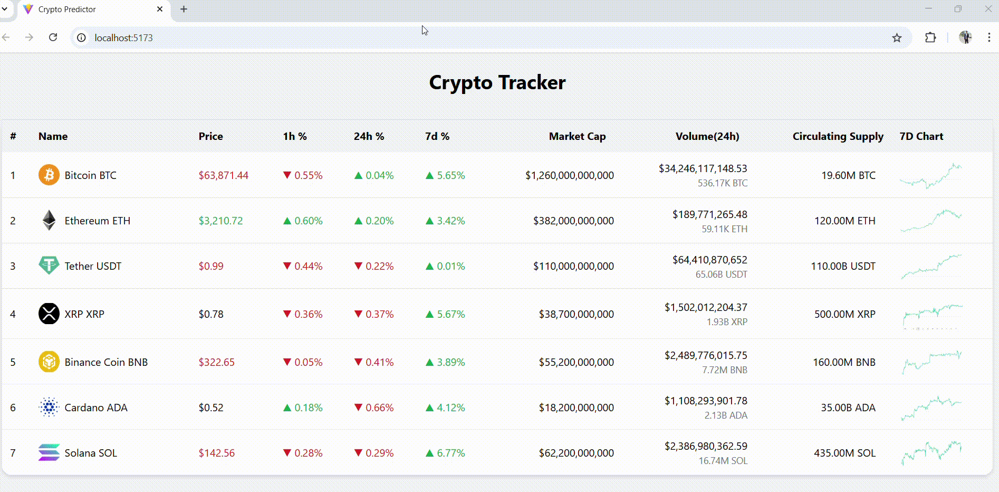

# 🚀 Crypto Tracker

A simulated real-time cryptocurrency tracker built with React and Redux. It displays live-looking prices, percent changes, market volume, and trend charts using mock WebSocket updates.

---

## 🛠️ Tech Stack

- **Frontend**: React
- **Styling**: Tailwind CSS
- **State Management**: Redux Toolkit
- **Data Simulation**: Custom WebSocket-like function
- **Data Source**: Local mock data (`sampleData`)
- **Chart Display**: Static images for 7-day trend

---

## 🧠 Architecture Overview

### Component Breakdown

- **`App.jsx`**  
  Renders app layout and includes title, `Simul`, and `CryptoTable`.

- **`CryptoTable.jsx`**  
  Displays cryptocurrency market data. Uses color and arrow indicators to show price trends based on Redux state.

- **`Simul.jsx` + `SimulateWebSocket`**  
  Simulates real-time updates by modifying price and volume every 1.5 seconds.

---

### 🔄 Redux State Logic

- **`cryptoSlice.js`**
  - Stores two slices of data:
    - `prices`: Current coin prices
    - `prevPrices`: Previous price snapshot to detect changes
  - The `updatePrices` reducer

## 📸 Demo

